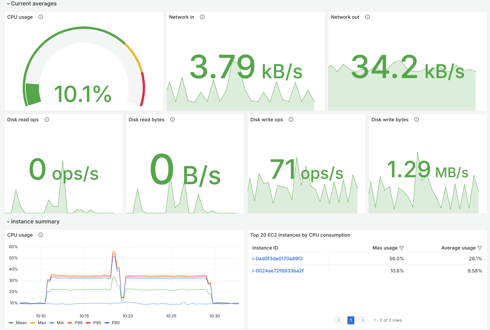

# Amazon GameLift Servers SDK for Unreal Engine

The Amazon GameLift Servers SDK for Unreal Engine is compatible with UE5 versions (5.0, 5.1, 5.2, 5.3, 5.4, 5.5, 5.6, 5.7, 5.8), and supports development and packaging of game servers for Windows or Linux, as well as game clients for any Unreal-supported platform.
The SDK supports both x64 and ARM architectures, with ARM architecture being supported starting from Unreal Engine version 5.0 and above.

## Install the SDK for Unreal Engine

Follow these steps to set up the SDK for Unreal Engine and add it to your Unreal Engine editor.

### Step 1: Install prerequisites

You’ll need the following tools to install and run the plugin with your Unreal projects.

* An AWS account to use with Amazon GameLift Servers. To use the plugin guided workflows, you need a user profile with your AWS account and access credentials. See [Set up an AWS account](https://docs.aws.amazon.com/gamelift/latest/developerguide/setting-up-aws-login.html) for help with these steps:
    * Sign up for an AWS account.
    * Create a user with permissions to use Amazon GameLift Servers.
    * Set up programmatic access with long-term IAM credentials.
* A source-built version of the Unreal Engine editor. You need a source-built editor to package a multiplayer game server build. See these Unreal Engine documentation topics:
    * [Accessing Unreal Engine source code on GitHub](https://www.unrealengine.com/ue-on-github) (requires GitHub and Epic Games accounts).
    * [Building Unreal Engine from Source](https://docs.unrealengine.com/5.3/en-US/building-unreal-engine-from-source/)
* A multiplayer game project with C++ game code. (Blueprint-only projects aren’t compatible with the plugin.) If you don’t have a project in progress, use one of the Unreal Engine sample games such as the [Third Person Template](https://dev.epicgames.com/documentation/en-us/unreal-engine/third-person-template-in-unreal-engine).
If you're starting a new Unreal project, create a game using the Third Person template and use the following settings:
    * C++
    * With starter content
    * Desktop
    * Custom project name (examples in this README use the name `GameLiftUnrealApp`)
* [Microsoft Visual Studio](https://visualstudio.microsoft.com/vs/) 2019 or newer.
* [Unreal Engine cross-compiling toolchain](https://dev.epicgames.com/documentation/en-us/unreal-engine/linux-development-requirements-for-unreal-engine#cross-compiletoolchain). This tool is required only if you’re building a Linux game server.

### Step 2: Get the plugin

1. Download the plugin `GameLift-Cpp-ServerSDK-UnrealPlugin-<version>.zip` from the repository’s [**Releases**](https://github.com/amazon-gamelift/amazon-gamelift-plugin-unreal/releases) page or clone the repository if you plan to customize it.
2. If you downloaded the plugin from the [**Releases**](https://github.com/amazon-gamelift/amazon-gamelift-plugin-unreal/releases) page, unzip the downloaded file `GameLift-Cpp-ServerSDK-UnrealPlugin-<version>.zip`. 
3. If you cloned the repository, run the following command in the root directory of the repository:
   
    For Linux or Mac:
    ```sh
    chmod +x setup.sh
    sh setup.sh
    ```

   For Windows:
    ```
    powershell -file setup.ps1
    ```

    Once completed, the plugin is ready to be added to an Unreal game project.

### Step 3: Add the plugin to your Unreal game project
1. Locate the root folder of your Unreal game project. Look for a subfolder named `Plugins`. If it doesn’t exist, create it.
2. Copy the entire `GameLiftServerSDK/` folder, either from this repository (after running the setup script) or from the unzipped release bundle, into the `Plugins` folder in your game project.
3. Open the `.uproject` file for your game project. Add the `GameLiftServerSDK` to the `Plugins` section:
    ```
    "Plugins": [
        ......
        {
            "Name": "GameLiftServerSDK",
            "Enabled": true
        }
    ]
    ```
4. In a file browser, select the game project `.uproject` file and choose the option **Switch Unreal Engine Version**. Set the game project to use the source-built Unreal Editor (as mentioned in Step 1).
5. (Windows) In the game project root folder, right-click the `.uproject` file and choose the option to generate project files. Open the solution ( `*.sln`) file and build or rebuild the project.


## Next steps: Integrate your game server and deploy for hosting

After you add the server SDK to your game project, see these Amazon GameLift Servers documentation topics for help with integrating your game code and preparing your game server to work with Amazon GameLift Servers.

* [Configure your game project for the server SDK](https://docs.aws.amazon.com/gamelift/latest/developerguide/integration-engines-setup-unreal.html#integration-engines-setup-unreal-setup)
* [Integrate Amazon GameLift Servers functionality into your game server code](https://docs.aws.amazon.com/gamelift/latest/developerguide/integration-engines-setup-unreal.html#integration-engines-setup-unreal-code)
* [Package your game build files](https://docs.aws.amazon.com/gamelift/latest/developerguide/gamelift-build-packaging.html)
* [Set up local testing with an Anywhere fleet](https://docs.aws.amazon.com/gamelift/latest/developerguide/integration-testing.html)
* Deploy your game server to the cloud with managed EC2
  * [Deploy a custom server build for Amazon GameLift Servers hosting](https://docs.aws.amazon.com/gamelift/latest/developerguide/gamelift-build-cli-uploading.html)
  * [Create an Amazon GameLift Servers managed EC2 fleet](https://docs.aws.amazon.com/gamelift/latest/developerguide/fleets-creating.html)
* Deploy your game server to the cloud with managed containers
  * [Build a container image for Amazon GameLift Servers](https://docs.aws.amazon.com/gamelift/latest/developerguide/containers-prepare-images.html)
  * [Create an Amazon GameLift Servers managed container fleet](https://docs.aws.amazon.com/gamelift/latest/developerguide/containers-build-fleet.html)

## Metrics

This telemetry metrics solution enables the feature to collect and ship telemetry metrics from your game servers hosted on Amazon GameLift Servers to AWS services for monitoring and observability. For detailed setup and usage instructions, see [METRICS.md](../TelemetryMetrics/METRICS.md).



## Troubleshoot plugin installation

#### Issue: When rebuilding the game project’s solution file after adding the plugin, I get some compile errors.

**Resolution:** Add the following line to your `<ProjectName>Editor.Target.cs` file to disable adaptive unity build, which may cause conflicts:
```
    bUseAdaptiveUnityBuild = false;
```

## SDK Logging Configuration

By default, Amazon GameLift Server SDK log messages are forwarded to Unreal Engine's logging system via `UE_LOG` under the `LogGameLiftServerSDK` category. These logs persist in UE's standard log output (e.g., `Saved/Logs/`) alongside your game's other log messages — no separate SDK log file is produced.

### Controlling visible log detail (UE verbosity)

The amount of SDK log output you see is controlled by Unreal's standard category verbosity for `LogGameLiftServerSDK`. The category's default runtime verbosity is **Log** (Info-level and above). This is the same mechanism used for all UE log categories and can be changed at any time — even while the server is running.

**Raise verbosity on the command line:**
```
-LogCmds="LogGameLiftServerSDK VeryVerbose"
```

**Raise verbosity at runtime (editor console or in-game console):**
```
Log LogGameLiftServerSDK VeryVerbose
```

**Set verbosity via ini (`DefaultEngine.ini` or per-platform Engine ini):**
```ini
[Core.Log]
LogGameLiftServerSDK=VeryVerbose
```

### Configuration (DefaultGame.ini)

Additional SDK-side logging settings are configured under the following section:

```ini
[/Script/GameLiftServerSDK.GameLiftLoggingConfig]
LogDestination=UELog
MinLogLevel=Trace
```

#### LogDestination

Controls where SDK logs are written.

| Value | Behavior |
|-------|----------|
| `UELog` (default) | SDK logs are forwarded to `UE_LOG(LogGameLiftServerSDK, ...)` and appear in Unreal's log output. |
| `SDKFile` | SDK uses its own internal file + stdout logging, fixed at `Info` level. Useful if you need the SDK's rotating log files separate from UE logs. **Note:** `MinLogLevel` has no effect in this mode (see below). |

#### MinLogLevel (optional hard cap)

Sets the minimum severity at which the SDK will emit log messages to the callback. Messages below this level are never formatted or forwarded. Only applies when `LogDestination=UELog` — when `LogDestination=SDKFile`, this setting is **ignored** and the SDK's built-in file logger always logs at a fixed `Info` level.

The default is **Trace** — all SDK messages reach the UE callback, and actual visibility is controlled by UE's category verbosity (see above). This default is deliberate: it preserves runtime verbosity toggling via `-LogCmds` and the console.

Setting `MinLogLevel` above Trace is an **opt-in production hard cap** that prevents the SDK from formatting messages below the cap, reducing overhead in performance-critical builds. The tradeoff: runtime verbosity toggling cannot reveal levels below the cap because the SDK filter is fixed at `InitSDK` time.

| Value | UE_LOG Verbosity | Description |
|-------|-------------------|-------------|
| `Trace` (default) | VeryVerbose | All SDK messages reach the callback |
| `Debug` | Verbose | Debug-level and above |
| `Info` | Log | Informational and above |
| `Warn` | Warning | Warnings and above |
| `Error` | Error | Errors and fatal conditions only |
| `Fatal` | Error | Fatal SDK messages only (logged as Error to avoid crashing the server) |
| `Off` | — | Suppresses all SDK log forwarding to UE_LOG |

### Examples

**Default behavior (no configuration needed):** All SDK messages reach UE_LOG. Visibility is controlled by the `LogGameLiftServerSDK` category verbosity (default: Log = Info and above).

**Enable verbose SDK logging for debugging:** Raise UE's category verbosity to see Trace/Debug messages that are already being forwarded:
```
-LogCmds="LogGameLiftServerSDK VeryVerbose"
```
Or at runtime in the console:
```
Log LogGameLiftServerSDK VeryVerbose
```
No ini change to `MinLogLevel` is needed — the default Trace already forwards everything.

**Production hard cap (reduce SDK overhead):**
```ini
[/Script/GameLiftServerSDK.GameLiftLoggingConfig]
MinLogLevel=Info
```
This prevents the SDK from formatting Trace/Debug messages entirely. Note: you cannot toggle verbosity below Info at runtime with this setting.

**Restore legacy SDK file logging:**
```ini
[/Script/GameLiftServerSDK.GameLiftLoggingConfig]
LogDestination=SDKFile
```
In this mode the SDK writes to its own rotating log files at a fixed `Info` level; `MinLogLevel` is not applied.

## Metrics

The Amazon GameLift Servers SDK for Unreal Engine provides a comprehensive metrics system for collecting and sending custom metrics from your game servers to Amazon GameLift. These metrics can be integrated with various visualization and aggregation tools including Amazon Managed Grafana, Prometheus, Amazon CloudWatch, and other monitoring platforms.

See below for a simple usage guide and see [CUSTOM_METRICS.md](../TelemetryMetrics/CUSTOM_METRICS.md) for a detailed API description.

## Quick Start

### Initialize the GameLift Metrics SDK

1. Include GameLiftMetrics.h at the top of your game mode source. `#include "GameLiftMetrics.h"`
2. Initialize the GameLift Metrics SDK

```c
    FGameLiftGenericOutcome InitSdkOutcome = GameLiftSdkModule->InitSDK(ServerParametersForAnywhere);
    // Initialize the GameLift metrics SDK
    FGameLiftMetricsModule::Load().Initialize();

    if (InitSdkOutcome.IsSuccess())
    {
        UE_LOG(GameServerLog, SetColor, TEXT("%s"), COLOR_GREEN);
        UE_LOG(GameServerLog, Log, TEXT("GameLift InitSDK succeeded!"));
        UE_LOG(GameServerLog, SetColor, TEXT("%s"), COLOR_NONE);
    }
    else
    ...
```
